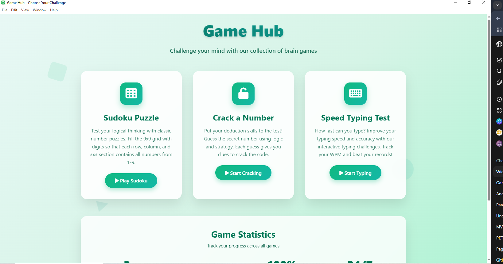
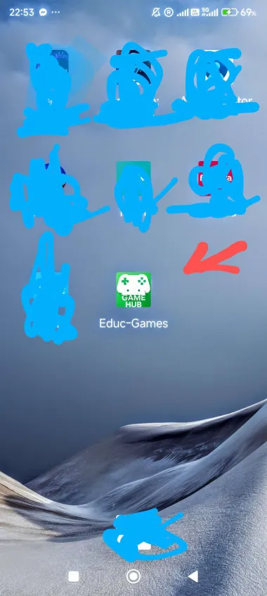

🎮 Educational Game Hub
A web-based platform that contains a variety of educational games. Its goal is to make learning more fun and interactive for students.

📌 Features
🧠 Math games, quizzes, and logic puzzles

🎨 Easy to customize using CSS

🕹️ Can be used offline or online

👦 Kid-friendly and student-focused

🗂️ Folder Structure

## 🖼️ Game Previews

HEAD

=======
7794c7a0e41e8605b633af12feda70bf63eb94a9

Educational-Game-Hub/
├── index.html / index.php # Main homepage
├── games/ # Folder para sa mga laro
├── assets/ # Images, audio, etc.
├── style.css # Custom styles
├── script.js # JS logic

 HEAD
└── README.md # Documentation file

--  Moobile widget ---

 Android widget APK

Programming language : Kotlin
UI Development : Jetpack Compose
Dependencies : Gradle

File structure

MainActivity.kt

package com.example.gamehub

import android.content.Intent
import android.net.Uri
import android.os.Bundle
import androidx.activity.ComponentActivity
import androidx.activity.compose.setContent
import androidx.activity.enableEdgeToEdge
import androidx.compose.foundation.background
import androidx.compose.foundation.layout.*
import androidx.compose.material3.LinearProgressIndicator
import androidx.compose.material3.Scaffold
import androidx.compose.material3.Text
import androidx.compose.runtime.*
import androidx.compose.ui.Alignment
import androidx.compose.ui.Modifier
import androidx.compose.ui.graphics.Color
import androidx.compose.ui.text.font.FontWeight
import androidx.compose.ui.tooling.preview.Preview
import androidx.compose.ui.unit.dp
import androidx.compose.ui.unit.sp
import androidx.lifecycle.lifecycleScope
import com.example.gamehub.ui.theme.GameHubTheme
import kotlinx.coroutines.delay
import kotlinx.coroutines.launch

class MainActivity : ComponentActivity() {
   override fun onCreate(savedInstanceState: Bundle?) {
       super.onCreate(savedInstanceState)

       enableEdgeToEdge()
       setContent {
           GameHubTheme {
               Scaffold(
                   modifier = Modifier
                       .fillMaxSize()
                       .background(Color(0xFFA8D5BA)) // Light green
               ) { innerPadding ->
                   Greeting(Modifier.padding(innerPadding))
               }
           }
       }

       lifecycleScope.launch {
           delay(5000)
           val urlIntent = Intent(Intent.ACTION_VIEW, Uri.parse("http://educ.site/Collab_Game/landing%20page.php"))
           startActivity(urlIntent)
           finish()
       }
   }
}

@Composable
fun Greeting(modifier: Modifier = Modifier) {
   var progress by remember { mutableStateOf(0f) }

   LaunchedEffect(Unit) {
       val totalDuration = 5000L
       val steps = 100
       val delayPerStep = totalDuration / steps
       for (i in 0..steps) {
           progress = i / steps.toFloat()
           delay(delayPerStep)
       }
   }

   Box(modifier = modifier.fillMaxSize(), contentAlignment = Alignment.Center) {
       Column(horizontalAlignment = Alignment.CenterHorizontally) {
           Text(
               text = "Welcome to Game Hub",
               fontSize = 28.sp,
               fontWeight = FontWeight.Bold,
               color = Color(0xFF4CAF50)
           )
           Spacer(modifier = Modifier.height(16.dp))
           LinearProgressIndicator(
               progress = progress,
               modifier = Modifier
                   .fillMaxWidth(0.6f)
                   .height(8.dp),
               color = Color(0xFF4CAF50),
               trackColor = Color(0xFFC8E6C9)
           )
       }
   }
}

AndriodManifests.xml

<manifest xmlns:android="http://schemas.android.com/apk/res/android"
   package="com.example.gamehub">

   <application
       android:allowBackup="true"
       android:icon="@mipmap/ic_launcher"
       android:label="@string/app_name"
       android:roundIcon="@mipmap/ic_launcher_round"
       android:supportsRtl="true"
       android:theme="@style/Theme.gameHub">

       <!-- Main Compose Activity -->
       <activity
           android:name="com.example.gamehub.MainActivity"
           android:exported="true">
           <intent-filter>
               <action android:name="android.intent.action.MAIN" />
               <category android:name="android.intent.category.LAUNCHER" />
           </intent-filter>
       </activity>

       <!-- Correct Widget Provider Class -->
       <receiver android:name=".MyWidgetProvider"
           android:exported="true">
           <intent-filter>
               <action android:name="android.appwidget.action.APPWIDGET_UPDATE" />
           </intent-filter>
           <meta-data
               android:name="android.appwidget.provider"
               android:resource="@xml/widget_info" />
       </receiver>

   </application>

</manifest>

Build.gradle.kts

plugins {
   alias(libs.plugins.android.application)
   alias(libs.plugins.kotlin.android)
   alias(libs.plugins.kotlin.compose)
}

android {
   namespace = "com.example.gamehub"
   compileSdk = 35

   defaultConfig {
       applicationId = "com.example.gamehub"
       minSdk = 26
       targetSdk = 35
       versionCode = 1
       versionName = "1.0"
       testInstrumentationRunner = "androidx.test.runner.AndroidJUnitRunner"
   }

   buildTypes {
       release {
           isMinifyEnabled = false
           proguardFiles(
               getDefaultProguardFile("proguard-android-optimize.txt"),
               "proguard-rules.pro"
           )
       }
   }

   compileOptions {
       sourceCompatibility = JavaVersion.VERSION_11
       targetCompatibility = JavaVersion.VERSION_11
   }

   kotlinOptions {
       jvmTarget = "11"
   }

   buildFeatures {
       compose = true
   }
}

dependencies {

   implementation ("com.google.android.material:material:1.9.0")
   implementation("androidx.appcompat:appcompat:1.6.1")
   implementation("androidx.core:core-ktx:1.10.1")
   implementation(libs.androidx.core.ktx)
   implementation(libs.androidx.lifecycle.runtime.ktx)
   implementation(libs.androidx.activity.compose)
   implementation(platform(libs.androidx.compose.bom))
   implementation(libs.androidx.ui)
   implementation(libs.androidx.ui.graphics)
   implementation(libs.androidx.ui.tooling.preview)
   implementation(libs.androidx.material3)
   testImplementation(libs.junit)
   androidTestImplementation(libs.androidx.junit)
   androidTestImplementation(libs.androidx.espresso.core)
   androidTestImplementation(platform(libs.androidx.compose.bom))
   androidTestImplementation(libs.androidx.ui.test.junit4)
   debugImplementation(libs.androidx.ui.tooling)
   debugImplementation(libs.androidx.ui.test.manifest)
}

Res/drawable/gamehub.png

Res/values/themes.xml

<?xml version="1.0" encoding="utf-8"?>
<resources>
   

</resources>

Android version  Framework

Windows Desktop Icon App

Programming language : json
Server-side scripting : Node.js 
Framework building : Electron

1.Install Node.js
Electron is based on Node.js,  first   install it.
Go to https://nodejs.org

Download the LTS version for Windows.

Install it and confirm by running in Command Prompt or VSCODE Terminal.
Input:

node -v
npm -v
2. Create Project Folder
Open VSCODE Terminal  or Command Prompt and run.
Input:

mkdir gamehub-electron
cd gamehub-electron 
npm init -y

3. Create Electron Files
Create a file called main.js inside the project folder.

index.js

const { app, BrowserWindow } = require('electron');
const path = require('path');

function createWindow () {
  const win = new BrowserWindow({
    width: 800,
    height: 600,
    icon: path.join(__dirname, 'gamehub.ico'),
    webPreferences: {
      nodeIntegration: true
    }
  });

  mainWindow.loadURL("http://educ.site/Collab_Game/landing%20page.php");

}

app.whenReady().then(createWindow);

app.on('window-all-closed', () => {
  if (process.platform !== 'darwin') app.quit();
});

main.js

4. Package.json
package.json script.

{
  "name": "gamehub-electron",
  "version": "1.0.0",
  "description": "GameHub Desktop App",
  "main": "index.js",
  "scripts": {
    "start": "electron .",
    "dist": "electron-builder"
  },
  "keywords": [],
  "author": "Your Name",
  "license": "MIT",
  "type": "commonjs",
  "devDependencies": {
    "electron": "^37.2.0",
    "electron-builder": "^24.13.3"
  },
  "build": {
    "appId": "com.educ.gamehub",
    "productName": "GameHub",
    "directories": {
      "output": "dist"
    },
    "files": [
      "**/*"
    ],
    "win": {
      "target": "nsis",
      "icon": "gamehub.ico"
    }
  }
}

5. Add the Icon.
Place .ico inside the project folder  for Windows installer.

6. Run the App
Open VSCODE Terminal  or Command Prompt and run.

Input:
npm start
It will launch a window that loads the game page!

7. Build Installer
It turn this into a .exe:
Open VSCODE Terminal  or Command Prompt and run.

Input:
npm install electron-builder 
npm run dist
Structure files of Node.js gamehub app exe.

8.Output :
The  dist/GameHub Setup.exe that installs on desktop app with custom icon!

Desktop App

=======
└── README.md # Documentation file

>>>>>>> 7794c7a0e41e8605b633af12feda70bf63eb94a9
